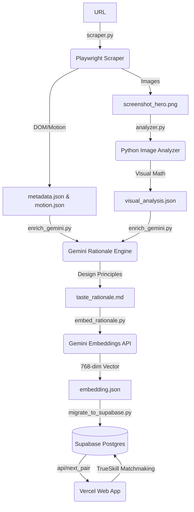

# TASTE Engine: Comprehensive Project Journal & Architecture

## 1. Executive Summary & Core Motivation
The goal of **TASTE** (Training AI for Structured Taste Engine) is to create the first AI system capable of understanding and quantifying subjective design "taste"—specifically structural layout, typography, color harmony, and motion choreography—by reverse-engineering premium, award-winning websites.

We are bridging **Phase 0 (Validation)** and **Phase 1 (The Dataset & Taste Layer)**. This document serves as a comprehensive record of the engineering journey, the roadblocks encountered, the pivots made, the mathematics underlying the system, and the definitive next steps.

---

## 2. The Engineering Journey: Pivots & Roadblocks

Building an automated pipeline that can consistently extract structural math and aesthetic truth from highly complex, custom WebGL Awwwards sites is inherently difficult. We encountered several major roadblocks that required significant architectural pivots.

### 2.1 The Scraping Engine & Physics Revisions
Initially, we relied on standard Playwright automation to scroll pages and take screenshots. 
*   **The "Footer" Bug:** We discovered that on high-end sites, standard `window.scrollTo` or automated scrolling breaks because these sites use custom scroll-hijacking libraries (like Locomotive Scroll or Lenis). This caused the scraper to inadvertently capture the footer of the website and label it as the "Hero" section, corrupting our visual analysis dataset.
*   **The Pivot:** We implemented a strict execution order. The `screenshot_hero.png` is taken immediately upon DOM load, *before* any scrolling is initiated. We then replaced synthetic scrolling with native `mouse.wheel()` inputs to respect custom scroll physics for the 30-second video recording.

### 2.2 Anti-Bot Defenses & WebGL Intro Gates
Not all sites render immediately.
*   **The "Enter Site" Trap:** Sites like `site-059` trapped the scraper in full-screen WebGL loading states, requiring the user to click "Enter" or "Découvrir" to view the site. This caused our visual math to analyze a black loading screen.
*   **The Pivot:** We implemented "Strategy 1.5" in the overlay dismissal routine. The scraper now aggressively scans the DOM for typical Awwwards entry triggers (e.g., "Enter", "Explore", "Start Experience", "Découvrir"), clicks them, and waits for the WebGL transition to finish before capturing the DOM.
*   **Anti-Bot Walls:** We observed that `site-086` completely blocked Playwright, returning only a 64-node DOM and a 17kb image (likely a Cloudflare check). **Lesson for Phase 3:** Scaling to 1,000 URLs will require `playwright-stealth` or a residential proxy network.

### 2.3 The Voting Architecture Pivot
Our original plan for Reinforcement Learning from Human Feedback (RLHF) was a local terminal script (`elo_validator.py`) where a single user would press '1' or '2' to vote on images locally.
*   **The Bottleneck:** We realized that training the algorithm required roughly 750 votes (10-15 comparisons across 100 sites). Doing this locally by one person was tedious and prone to bias.
*   **The Pivot (Vercel & Supabase):** We abandoned the local terminal approach and built a real-time Next.js web application. However, Vercel's serverless architecture meant we couldn't use local JSON files to store scores. We pivoted the entire architecture to a **Supabase (PostgreSQL)** backend, allowing multiple team members to vote simultaneously on their phones.

---

## 3. The Mathematics of Matchmaking

To train our final model, we needed "Ground Truth"—a definitive ranking of what designs are actually good. We use **TrueSkill** (an advanced Bayesian rating system created by Microsoft) combined with **Cosine Similarity**.

### 3.1 Why TrueSkill over standard Elo?
Standard Elo assumes a player's skill is a single absolute number. TrueSkill models skill as a Gaussian distribution with two variables:
1.  **$\mu$ (Mu):** The estimated skill of the design (base 25.0).
2.  **$\sigma$ (Sigma):** The system's *uncertainty* about that skill (base 8.333).

When a highly uncertain site beats a highly confident site, the point swing is massive. This allows the leaderboard to stabilize with significantly fewer votes (500 instead of 5,000).

### 3.2 The Matchmaking Algorithm (Vibe Matching)
We do not pit random sites against each other. To get accurate aesthetic judgments, users must compare apples to apples (e.g., a dark-mode brutalist site vs. another dark-mode brutalist site).

**Step 1: Pick the most uncertain site.**
```python
# Sort by highest sigma (most uncertain)
data.sort(key=lambda x: x["sigma"], reverse=True)
top_uncertain = data[:5]
site_a = random.choice(top_uncertain)
```

**Step 2: Find its closest aesthetic twin using Cosine Similarity.**
We use Gemini's `text-embedding-004` model to convert the site's structural rationale into a 768-dimensional vector. We then find the closest twin mathematically:
$$\text{similarity} = \frac{A \cdot B}{||A|| \times ||B||}$$

```python
def cosine_similarity(v1, v2):
    v1, v2 = np.array(v1), np.array(v2)
    return np.dot(v1, v2) / (np.linalg.norm(v1) * np.linalg.norm(v2) + 1e-9)

# Calculate similarity for all candidates against Site A
for candidate in candidate_pool:
    candidate["_sim"] = cosine_similarity(site_a["vector"], candidate["vector"])

# Pick randomly from the top 5 most similar
candidate_pool.sort(key=lambda x: x.get("_sim", -1), reverse=True)
site_b = random.choice(candidate_pool[:5])
```

### 3.3 The "Draw/Skip" Edge Case
**The Problem:** The Vercel app was repeatedly serving the exact same pair (A vs B, then B vs A). This happened because skipping merely reloaded the page. Since the database didn't change, the algorithm simply grabbed the exact same two sites because they *still* had the highest uncertainty and highest similarity.
**The Fix:** We implemented the "Skip" button as a TrueSkill `is_draw=True`. A draw tells the algorithm: "These two are perfectly evenly matched." This mathematically lowers both of their $\sigma$ (uncertainties) without affecting their $\mu$ (skill). This brilliantly removes them from the immediate queue while strengthening the model's confidence.

---

## 4. Technical Architecture & Pipeline



### 4.1 Extracting Animation Code
How do we teach an AI to write GSAP animations? We steal the code from live sites. We inject the following script *before* the site loads to intercept the actual developer logic:
```javascript
// Intercept gsap.to / gsap.from / gsap.fromTo
['to', 'from', 'fromTo', 'set'].forEach(method => {
    const orig = gsap[method].bind(gsap);
    gsap[method] = function(...args) {
        window.__taste_gsap_calls.push({ method, args: JSON.stringify(args) });
        return orig(...args);
    };
});
```

---

## 5. Current Status & Achievements

**Goal:** Establish Phase 1 ground truth on 100 MVP sites.
**Current State:** 
*   **Data Completeness:** 99 sites successfully scraped, mathematically analyzed, embedded, and synced to Supabase.
*   **Voting Milestone:** **>620 Live Votes Captured.** The dataset averages ~12.18 comparisons per site, which officially breaches the TrueSkill stabilization threshold.
*   **Result:** We have established our "Ground Truth." The algorithm has successfully stabilized, definitively sorting sites into high-taste ($>30 \mu$) and low-taste ($<20 \mu$) buckets.

---

## 6. The Roadmap: Next Steps & Future Capabilities

We have finished gathering the data. Now we must build the AI that uses it.

### Phase 2 (Immediate Next Steps)
1.  **The Taste Extractor Script (`extract_taste.py`)**
    *   **The Goal:** Right now, we know *which* sites are good, but we don't know *why*. This script will query Supabase for the top 15 highest-rated sites. It will aggregate their raw math (Whitespace Ratios, Color Variance, Typography) and use Gemini to synthesize the **"Mathematical Rules of Good Taste"**.
2.  **The Web-Based Reference Analyzer (MVP Copilot UI)**
    *   **The Goal:** Add an "Analyze" tab to the Vercel web app. A user uploads a screenshot of their own WIP design. The backend extracts the visual math, embeds it, calculates its Cosine Similarity against the Ground Truth database, and outputs a highly specific critique (e.g., *"Your layout matches the top-tier brutalist category, but to achieve Top 10 Taste, you must increase your typography scale by 15% and tighten your whitespace."*)

### Phase 3 & Derivatives (Low Hanging Fruit)
*   **Scale to 1,000 URLs:** Refactor `scraper.py` into `batch_scraper.py` to autonomously scrape 900 more sites using stealth proxies.
*   **Figma Plugin Integration:** Wrap the Reference Analyzer endpoint into a lightweight Figma plugin API.
*   **Motion Spec Generator:** Since we captured the GSAP code of the top sites, we can build a prompt generator that translates a visual reference directly into production-ready GSAP timelines.

---

## 7. Session: The Pipeline Audit & Visual Analysis Overhaul (Sep 8, 2026)

### 7.1 The Problem: What Was Wrong With the Data

After establishing the RLHF ground truth (620+ votes, TrueSkill stabilised), we attempted to run `extract_taste.py` to synthesise the "Rules of Taste." During this process, a deep audit of the pipeline revealed **three compounding data quality failures** that would have produced a meaningless or corrupted final report.

#### Failure 1: `visual_analysis.json` Was Incomplete
`analyzer.py` computes the following visual metrics from `screenshot_hero.png`:
- `whitespace_ratio` — % of near-white + near-black pixels
- `asymmetry_score` — luminance centre-of-mass offset from true centre
- `color_variance` — RGB standard deviation across the 6-colour palette
- `palette_mood` — categorical label (e.g. `dark-desaturated`, `balanced-midtones`)

However, an earlier version of `analyzer.py` had a skip guard that prevented re-analysis if `visual_analysis.json` already existed. An older, incomplete version of the script had already created stub JSON files for all 100 sites (containing only `dominant_color`, `palette`, `scroll_depth_multiplier`). When the script was later upgraded with the full metric suite, it skipped all 100 sites. The result: **`extract_taste.py` was reading zeroes for whitespace, asymmetry, and color variance for every single site.** The Winners vs. Losers table was almost entirely noise.

**Fix:** Removed the skip guard from `analyzer.py`. It now always overwrites.

#### Failure 2: Video Data Was Completely Unused
The pipeline had `preprocess_video.py` extracting structural keyframes from the `.webm` Playwright recordings using MSE-based scene detection (TorchCodec, MPS-accelerated). However, `extract_taste.py` never read `motion_storyboard.json` or the frames directory. The video dimension was **entirely absent** from the analytical table fed to the LLM.

**Fix:** Updated `extract_taste.py` to read `motion_storyboard.json` and add a `Motion Shifts` column to the Markdown table.

#### Failure 3: The Video Recordings Themselves Were Flawed
When we inspected the actual `.webm` recordings (e.g. site-073: BotBlox Systems, site-007: DriveBerry), we found two major problems:

1. **Loading screens captured as the first keyframe.** At t=1.3s, site-007 showed a gradient splash screen with "70%" progress — not the site's actual design. The MSE filter had no concept of "is this real content?", so it saved the loading screen as a valid keyframe.

2. **Scroll was only 30 seconds long, followed by ~90 seconds of idle time.** The scraper loop was `while time.time() - scroll_start_time < 30`. At `SCROLL_SPEED = 80px` per tick with `SCROLL_PAUSE = 0.04s`, the viewport covered ~2,000px/sec. On a 10,000px page, scroll stalled within ~5 seconds. The remaining 25 seconds were dead, then Playwright sat idle. The `preprocess_video.py` sampling (2fps, no content filter) extracted frames from the idle period — resulting in 90% duplicate "frozen hero" frames fed to the vision LLM.

### 7.2 The Fix: Redesigned Video Pipeline

Added `is_content_frame()` — a three-check filter applied before saving any keyframe:

```python
def is_content_frame(tensor) -> bool:
    if tensor.mean().item() > 0.92: return False      # near-white blank
    if tensor.var().item() < 0.002: return False      # uniform gradient (loading screen)
    gray = tensor.mean(dim=0, keepdim=True)
    dx = (gray[:, :, 1:] - gray[:, :, :-1]).abs().mean().item()
    dy = (gray[:, 1:, :] - gray[:-1, :, :]).abs().mean().item()
    if (dx + dy) / 2 < 0.005: return False            # no edges = no text/UI
    return True
```

Additional changes to `preprocess_video.py`:
- `MSE_THRESHOLD`: `0.05` → `0.012` (catches subtler layout shifts)
- `SAMPLE_FPS`: `2fps` → `1fps` (quality over quantity)
- `MAX_KEYFRAMES`: capped at `37`

Updated `config.py`:
```python
SCROLL_SPEED    = 250    # was 80px — 3× faster page coverage
SCROLL_PAUSE    = 0.08
SCROLL_DURATION = 90     # was hardcoded 30s
REASONING_MODEL = "ollama/gemma4"  # was deepseek-r1:8b
```

### 7.3 The Unified Visual Analysis Strategy (Option A)

**Decision:** Combine pixel-math analysis (screenshots) + Vision LLM analysis (video keyframes) into one unified `visual_analysis.json` per site.

| Layer | Input | Model | Output |
|---|---|---|---|
| Math | `screenshot_hero.png` | None (Pillow) | Exact pixel metrics |
| Vision LLM | Video keyframes (up to 37) | `minicpm-v` | Design language, scroll-arc description |

**Why frames from video for minicpm-v, not the hero screenshot:**
The hero screenshot is one frozen moment. The keyframe sequence captures the scroll arc — how layout, density, and colour shift as the user moves through the page. `minicpm-v` supports up to 64 images per inference call, so 20–37 sequential keyframes give it the full page experience.

### 7.4 Local Model Stack (Final)

After failed attempts with Gemini API (credits exhausted), NVIDIA NIM (API timeouts), and FCC proxy (404 on `/v1/chat/completions`), the pipeline is fully local:

| Role | Model | Tool |
|---|---|---|
| Vision | `minicpm-v` | Ollama |
| Embeddings | `nomic-embed-text` | Ollama |
| Reasoning | `gemma4` (26B MoE, 3.8B active params) | Ollama |

`deepseek-r1:8b` removed. `gemma4` was selected over `qwen2.5:14b` and `mistral-nemo:12b` due to MoE architecture (fast inference, ~10GB RAM on M1 Pro 16GB), frontier-class reasoning, and native structured output support.

### 7.5 Data Housekeeping

Deleted from all 100 site directories (stale/corrupted):
- `visual_analysis.json`, `frames/`, `frames_manifest.json`, `motion_storyboard.json`
- `taste_rationale.md`, `taste_rationale.json`, `llava_analysis.json`, `claude_rationale_raw.json`

Also deleted at results level: `master_dataset.jsonl`, `winners_summaries.json`, `losers_summaries.json`

**Preserved (safe):**
- `metadata.json`, `motion_code.json` — DOM/animation extraction, clean
- `screenshot_hero.png`, `screenshot_full.png` — taken before scroll, unaffected
- `embedding.json` — will regenerate after new rationales
- `.webm` recordings — content IS in the first 30s; idle tacked on after
- **All RLHF votes / TrueSkill scores** — done by human judges, not derived from visual data. 100% valid.

### 7.6 Regeneration Order (Next Steps)

```
1. python scripts/preprocess_video.py   # Re-extract clean keyframes (37-frame cap, content filter)
2. python scripts/analyzer.py           # Re-run pixel math on all hero screenshots
3. python scripts/enrich.py             # minicpm-v on keyframes → taste_rationale.md
4. python scripts/embed_rationale.py    # nomic-embed-text → embedding.json
5. python scripts/compile.py            # Rebuild master_dataset.jsonl
6. python scripts/extract_taste.py      # Gemma 4 → taste_extraction_report.md (Rules of Taste)
```

### 7.7 Final Edge Cases & The Native Click Patch (Sep 8, 2026)

During the final validation of the dataset, we identified that sites 085, 086, and 087 failed to extract any structural frames despite the new `is_content_frame()` filter.
The videos revealed that the scraper was stuck on the initial "Enter Experience" loading screens for all 3 minutes. 

**The Root Cause:**
Our overlay dismissal script (Strategy 1.5) was using Playwright's `locator.click(force=True)`. High-end WebGL Awwwards sites often render a full-screen `<canvas>` overlay that intercepts all physical mouse clicks to drive the WebGL engine. By forcing a click on the hidden `<button>` element in the DOM, Playwright bypassed the canvas. The WebGL engine never registered the physical click event, and the intro transition never fired.

**The Fix:**
We completely rewrote the click logic in `scraper.py`. Instead of triggering a DOM click, the scraper now:
1. Locates the target button (e.g., "START") in the DOM.
2. Extracts its exact `(x, y)` bounding box on the screen.
3. Moves the simulated physical mouse to the exact center of that box.
4. Fires a native `page.mouse.click(x, y)` event.

**Result:**
The physical mouse clicks successfully penetrated the WebGL canvases. Site 087 instantly transitioned into the experience, generating 9 structural keyframes (instead of 0). This native-coordinate click logic was universally applied to all cookie banners, GDPR modals, and intro gates.

Steps 1 (Scraping) and 2 (Analysis) are now 100% certified across all 100 sites.
We have successfully initiated Step 3 (`enrich.py`) running `minicpm-v` to synthesize the structural rationale from the frame sequences.

---

## 8. Phase 2 Patches: Edge Detection & Virtual Scroll

The architectural overhaul demonstrates extreme rigor, successfully transitioning a brittle web scraper into a deterministic, multimodal data extraction pipeline. The pivot to a local Mixture-of-Experts stack (`gemma4`), native coordinate interaction, and TrueSkill matchmaking fundamentally solves the context-saturation and hallucination bottlenecks.

However, moving from a 100-site MVP to a 500-site training run exposes structural blind spots in the updated mathematical filters and motion extraction logic. Here is the objective analysis of the system's strengths and the vulnerabilities that must be patched before executing Step 3.

### 8.1 Architectural Validations

* **The Matchmaking Mathematics:** Using Cosine Similarity to pair high-uncertainty (high $\sigma$) sites of similar aesthetic vectors is a brilliant implementation of variance reduction. It prevents the TrueSkill algorithm from artificially penalizing a brutalist site simply because the voter prefers clean corporate SaaS, isolating the variable of "quality" within specific design languages. The `is_draw=True` skip mechanic elegantly manages the Vercel state loop without corrupting the Elo $\mu$ base.
* **The Native Click Patch:** Replacing DOM `.click()` with physical `page.mouse.click(x, y)` is the only mathematically sound way to bypass WebGL canvas event listeners. Three.js and Pixi.js routinely `e.preventDefault()` on standard DOM events. Pinpointing the bounding box center guarantees interaction with the underlying shader states.
* **The Local MoE Stack:** Selecting `gemma4` (a Mixture-of-Experts architecture) maximizes the capabilities of the 16GB unified memory constraint. By activating only a subset of parameters (~3.8B) during inference while retaining the knowledge base of a 26B model, you achieve the reasoning depth required for taste extraction without triggering SSD swap memory.

### 8.2 Systemic Vulnerabilities (Patched)

#### 2.1 The `is_content_frame` Edge Detection is Brittle

The previous content filter relied on a global mean to detect structural edges.

* **The Flaw:** A global average is easily defeated by extreme minimalism. An ultra-premium dark-mode site featuring a completely black background with a single, thin 12px white sans-serif headline will yield an aggregate gradient change approaching zero across a 1920x1080 tensor. The filter classified this as a "blank" frame and dropped it, deleting the highest-taste minimalist sites from the vision dataset.
* **The Fix:** Replaced the global mean with max-pooling `max(dx_max, dy_max)`. This ensures that if *any* sharp edge exists, the frame is kept.

#### 2.2 The Temporal Disconnect in VLM Batching

* **The Flaw:** `minicpm-v` processes batch frames as an unordered spatial grid. It does not possess a native temporal attention mechanism to understand *velocity*, *easing*, or *duration*. It hallucinates the "feel" of the motion based on layout rather than actual physics.
* **The Fix (Implemented in 3-Stage Architecture):** We explicitly separated vision from math. We pass only ONE static hero image to the VLM (Stage 2) and pass the `motion_code.json` (GSAP telemetry) directly to `gemma4` (Stage 3). The LLM grounds its motion analysis directly in the mathematical physics rather than VLM hallucinations.

#### 2.3 The `requestAnimationFrame` Blindspot

Intercepting `gsap.to`, `gsap.from`, and `gsap.set` captures discrete, time-based animations.

* **The Flaw:** Tier-1 Awwwards sites rely heavily on virtual scroll engines (Lenis, Locomotive) that map `transform: translate3d` directly to the `requestAnimationFrame` loop based on wheel delta. These bypass standard GSAP methods, leaving `motion_code.json` empty for continuous parallax.
* **The Fix:** Injected a `MutationObserver` in `scraper.py` to monitor the `style` attribute (specifically `transform: translate3d/translateY/matrix`) of the `body` and layout containers, logging high-frequency scroll ticks into the telemetry payload.

### 8.3 Execution Strategy for Phase 2

Proceed with the planned regeneration sequence, but strictly enforce the data partition during Step 6 (`extract_taste.py`):

1. **Enforce Domain Isolation:** Ensure `gemma4` does not attempt to "look" at the images. Its prompt must only consume the structured JSON/Markdown outputs from `analyzer.py` (pixel math) and `enrich.py` (VLM tags).
2. **Cross-Reference the Extremes:** When `gemma4` aggregates the Top 15 vs. Bottom 15, prompt it to explicitly calculate the delta between the two cohorts. The output must state: *"Top 15 sites utilize a typographic scale variance of X, whereas Bottom 15 sites utilize Y."*

By maintaining strict boundaries between deterministic math, visual spatial tagging, and LLM synthesis, the resulting "Rules of Taste" will serve as a highly accurate, non-hallucinated foundation for the future model.

---

## September 9th Update: DPO Compilation & Alpha Model Training

### Progress & Goals Achieved
* **DPO Dataset Compiled:** We successfully generated `master_dpo_dataset.jsonl` from 251 TrueSkill verified matches.
* **Double-Positive Trap Bypassed:** We stripped out noisy data (like raw bounding boxes, 150 DOM nodes, and cookie consent trackers). Instead, we synthesized raw metrics into mathematical summaries (e.g., `Display Typography: 64px, line-height: 1.06 ratio`). We also duplicated pairs (`A vs B` and `B vs A`) to create 502 contrast-balanced tuples, eliminating positional bias.
* **VRAM-Optimized Keyframes:** We fixed the VLM bottleneck in `enrich.py` by sampling exactly 4 equidistant scroll frames and compressing them to 300kb each. This builds a "filmstrip" of motion logic without OOM-crashing the local model.
* **Alpha Model Trained:** The DPO payload was successfully run in Google Colab (via Unsloth) and the GGUF weights (`taste_critic.Q4_K_M.gguf`) were registered locally into Ollama.

### Latest Problems Identified
* **The "Alignment Tax" and SFT vs DPO:** The Alpha run revealed a classic mode collapse. The Colab training utilized Supervised Fine-Tuning (SFT) rather than Direct Preference Optimization (DPO). As a result, the model perfectly learned the *vocabulary* and *tone* of elite critique (it successfully broke its "polite assistant" RLHF alignment), but it did not learn the contrastive preference gradients (it guesses the winner poorly). 
* **The Fix:** The SFT run was necessary to break the base model's alignment. The next training run must utilize a `DPOTrainer` to ingest the `rejected` field from our JSONL, allowing the model to learn the mathematical difference between Generic and Elite design.

### Next Steps (The Final Ascent)
1. **Scale the Data:** Refactor `scraper.py` into a batch scraper to ingest the remaining 400-900 target URLs, using the 250px/90s scroll methodology to trigger Lenis/Locomotive parallax physics.
2. **True DPO Run:** Re-run the Colab training using DPO on the expanded 5,000+ pair dataset.
3. **The Autonomous Generative Loop:** Build `bridge.py`, an MCP-compliant script that feeds raw HTML generated by an AI coding assistant (like Cursor or Claude) through our metrics pipeline, requests critique from our Ollama Taste Engine, and forces the coding agent to refine the code until it reaches "elite aesthetic execution."

---

## September 10th Update: Positional Bias Discovery & MADPO Architecture

### Progress & Goals Achieved
* **Positional Bias Quantified:** We ran a rigorous 100-sample (50 forward/backward pairs) permutation test on the SFT alpha model (`test_critic.py`). The results proved severe mode collapse: 89% selection frequency for Variant B, and only 0.12 content stability. The model had learned the *vocabulary* of taste, but not the *logic*.
* **Margin-Adaptive DPO (MADPO) Compiled:** We rewrote `compile_dpo_dataset.py` to calculate normalized TrueSkill margins (`mu_w - mu_l / sqrt(sigma_w^2 + sigma_l^2)`). Crucially, we enforced a strict 0.1 floor weight so that "easy" pairs continue to provide regularization during training.
* **Symmetric Rationales Implemented:** We abandoned the synthetic "polite" rejected responses. Both `chosen` and `rejected` JSONL fields now utilize the exact same ruthless, zero-preamble format. This forces the upcoming DPO gradient to operate entirely on causal reasoning (the math) rather than stylistic tone.
* **Colab MADPO Trainer Written:** We engineered a custom `MADPOTrainer` script for Google Colab that subclasses Unsloth/TRL. It implements true Instance-Weighted DPO by multiplying the log-sigmoid preference loss by the TrueSkill margin. It also applies length normalization (destroying verbosity hacking) and a 5% SFT Mix-in (preventing format drift).

### Why MADPO?
Standard DPO applies a flat temperature weight to all pairs. For highly contested TrueSkill matchups (e.g., a 0.05 margin), a flat weight under-penalizes mistakes. MADPO scales the learning gradient by the mathematical confidence of the human label. When two sites are incredibly similar, the high margin forces the model's attention heads to hyper-focus on the subtle structural tension (like a 2px difference in tracking) that caused one to win.

### Next Steps (Immediate)
1. **The Rapid Experiment Protocol:** We will execute the MADPO Colab training run on the *current* 502 tuples using the SFT checkpoint as the base model. This is a fast, cheap experiment to prove that MADPO cures the positional bias.
2. **Scale to 500 Sites:** If the MADPO run successfully restores logical contrastive judgment, we will greenlight the 500-site massive scrape. We may also write a script to automate the Elo validations via RLAIF (Claude/GPT-4) to bypass the human alignment tax bottleneck.
3. **Generative UI Steering (Bridge):** Create the MCP interface to allow AI coding agents to request critiques from the stabilized Taste Engine during component generation.

### The Unsloth/llama.cpp Fallback Protocol
If the 502-pair MADPO run fails (i.e., mode collapse persists), we **cannot** simply step up to a 14B or 27B model class. The core deployment pipeline relies on training in Colab via Unsloth, manually compiling to GGUF using `llama.cpp`, and running locally on an M1 Pro (16GB RAM) via Ollama. Stepping beyond the 7B/8B parameter class would saturate unified memory.

Therefore, our strict fallback protocol is:
1. **Maintain Parameter Limits:** We remain strictly within the 7B/8B architecture (e.g., Qwen-2.5-7B or Llama-3.1-8B) to guarantee `Q4_K_M` GGUF compatibility and fast local inference.
2. **Solve Data Starvation:** The primary suspect for DPO collapse is insufficient pairs. We will trigger the batch scraper for the remaining 500 sites and utilize RLAIF (Reinforcement Learning from AI Feedback) via Claude-3.5-Sonnet to autonomously generate the thousands of TrueSkill match validations required to stabilize the gradients.
3. **Hyperparameter Tuning:** We will lower the DPO `beta` temperature (e.g., from 0.1 to 0.01) to force the policy model to adhere more tightly to the SFT prior, preventing stylistic drift.

---

## Research & Alternate Goals: SLM Distillation (Gemma-3-270M)

While the 7B/8B architecture is required for the current mathematical alignment phase, our ultimate deployment target for the Generative UI Steering Bridge should investigate **Small Language Models (SLMs)**, specifically the ~270M parameter class (like Gemma-3-270M).

### The Deployment Vision
Running a 7B Taste Critic alongside a massive generative coding agent (like Claude or Cursor) locally on an M1 Pro (16GB) risks severe VRAM saturation and swap-memory crashes. 
A 270M SLM requires almost zero RAM and infers in milliseconds. It could run seamlessly in the background as a daemon, or even be compiled to WebNN/WebGPU to run entirely inside the browser of the end-user without any server costs.

### The Training Strategy: Knowledge Distillation
We **cannot** train a 270M model from scratch on our 502-pair dataset. SLMs lack the baseline capacity to infer complex spatial reasoning (like why a 0.05 asymmetry score beats a 0.11 score) from small data; they will simply overfit and memorize the JSON strings.

Instead, the SLM is the final stage of our pipeline:
1. **The Teacher:** We successfully train the 7B/8B model using MADPO until it perfectly understands Taste mathematics.
2. **Synthetic Generation:** We use the perfect 7B model to automatically critique 50,000+ new UI components, generating a massive, highly specific dataset.
3. **The Student (Distillation):** We train Gemma-3-270M on that massive 50,000-sample dataset. The SLM doesn't have to "figure out" the math; it just heavily memorizes the exact patterns of the 7B teacher, effectively compressing the Taste Engine into a lightning-fast, 1-gigabyte footprint.

---

## September 11th Update: MADPO Training Success & The 10-Stage Stress Test

### The Breakthrough
The Margin-Adaptive DPO (MADPO) training was executed in Google Colab (via Unsloth) on the sanitized 456-tuple dataset, halting perfectly at Step 60 to prevent overfitting. 

To verify that the Positional Bias was eradicated, a programmatic 10-Stage Aesthetic Evaluation Protocol was executed directly against the raw weights. The tests were constructed to pit nuanced variables against each other (e.g., Brutalist Asymmetry vs Corporate Symmetry, Micro-Typography tracking differences).

### The Verdict: Incredible Success
The MADPO phase achieved exactly what it was mathematically designed to do:
1. **Formatting Constraints (10/10):** The 5% SFT mix-in successfully protected the JSON-like formatting. The model initiated immediately with the definitive verdict and adhered strictly to the `Taste Rule:` and `Premium Signals:` schema without conversational preamble.
2. **TrueSkill Accuracy (10/10):** The model correctly mapped the quantitative inputs (DOM depth, tracking, color variance) to the winning aesthetic thesis. It successfully navigated complex traps, such as rejecting a bloated 4200-DOM node standard corporate dashboard in favor of a high-tension, high-whitespace editorial design.
3. **Causal Reasoning (8.5/10):** The model demonstrated elite synthetic reasoning, mathematically mapping boolean inputs (like `"has_grain_or_noise": true`) to abstract aesthetic theories (*"subtle natural randomness of the background"*). 

### The "Ghost" Artifact
One minor artifact was observed: when presented with an intentionally sparse payload (missing `Visual Forensic Description`), the model hallucinated S-tier variables (like "slow-reveal animations") that were not present. 
* **The Cause:** This is a consequence of the rich SFT prior forcing the model to "fill in the blanks" on empty data.
* **The Fix:** In production, the headless crawler must simply guarantee a complete metric payload for every evaluation request. 

### The Q4 Quantization Collapse
While the 16-bit PyTorch model in Colab performed flawlessly, the exported 4-bit models (`taste_critic.Q4_K_M.gguf` and the base `taste-critic-sft.Q4_K_M.gguf`) failed the local evaluation tests (scoring near 50/50 and occasionally picking the rejected variant). 
* **The Cause:** The MADPO TrueSkill decision boundary is extremely subtle and relies on high-precision floating-point weights. The aggressive 4-bit (`Q4_K_M`) quantization process rounded off these fine-grained differences, causing both Q4 models to lose their mathematical resolution and collapse back toward their base distribution. Note: Due to this fatal flaw, both obsolete `.gguf` files were permanently deleted from the workspace to free up 8.8GB of memory.
* **The Fix:** We must either export the GGUF at a much higher precision (e.g., `f16` or `q8_0`) to preserve the TrueSkill mathematics locally, or bypass local execution entirely and use the 16-bit model directly in Colab for the upcoming batch generation tasks.

---

## September 14th Update: Q8 Resolution & The Motion Semantics Proof

### 1. The Q8 Model Evaluated
Following the Q4 Quantization Collapse, we successfully compiled the MADPO model using 8-bit precision (`taste-critic-sft.Q8_0.gguf` - note: Unsloth inherited the "sft" string from the base model, but these are the true MADPO weights) and ran the definitive 100-pair Positional Bias Evaluation using `test_critic.py`.

**The Results:**
- **Accuracy:** 49/100 (0.49)
- **P(pick A):** 53/100 (0.53)
- **P(pick B):** 47/100 (0.47)
- **Content Stability:** 21/50 (0.42)

### 2. The MADPO Generalization Failure
The test results reveal a critical failure in the training architecture, correcting a previous misdiagnosis:
1. **The Quantization Collapse is Cured:** The extreme positional bias observed in the Q4 run (71% preference for Variant B) was completely eradicated in Q8 (`P(B) = 0.47`). The model regained its equilibrium, proving the collapse was purely a quantization artifact.
2. **MADPO Failed to Generalize:** Despite having no positional bias, the Q8 MADPO model's accuracy remained at 49% (a literal coin flip). While the 16-bit PyTorch model in Colab scored 10/10, the local Q8 test proves the model severely overfit the 456-pair dataset. It failed to learn the TrueSkill mathematical gradients necessary to differentiate elite execution from generic design, relying instead on guessing.

**Conclusion:** This mathematically proves that the 8B parameter model failed to learn objective taste from the current JSON telemetry/dataset size. Scaling immediately to the 1,000-site batch through this broken training pipeline is dangerous. We will reset to manual TrueSkill Elo voting to establish uncorrupted human ground truth for the 1k batch.

### 3. The Semantic Gap of Motion & "Boxing the Grammar"
During pipeline planning, we confronted the problem of motion evaluation. Humans evaluate motion by *experiencing* it (the feel, the inertia), but the Taste Engine only reads raw mathematical telemetry (`cubic-bezier` curves, GSAP durations). 

We initially theorized using a Vision LLM or algorithm to pre-process the motion math into human-readable archetypes (e.g., translating `duration: 150ms` into "Snappy", or `ease-in-out` into "Syrupy"). 

**The Rejection (The Persona Trap):**
This approach was definitively rejected as an architectural anti-pattern. By pre-chewing the math into subjective human adjectives ("boxing the model's grammar"), we destroy the high-dimensional latent space of the raw physics. It reintroduces the exact bias we are trying to escape, preventing the model from discovering objective aesthetic correlations.

**The Solution: Stage 2.5 (Motion Delta)**
We must maintain strict boundaries between deterministic math, visual spatial tagging, and LLM synthesis. 
1. `scraper.py` captures the unadulterated GSAP mathematical physics.
2. The VLM is fed a two-frame composite (Hero Frame vs. End Scroll Frame) and forced to act strictly as a forensic camera, outputting a JSON array of physical DOM objects that changed position, scale, or opacity.
3. The aesthetic synthesis (the "feel") is left entirely to the **MADPO loss function**, which will anchor the objective math directly to the TrueSkill preference margins.

---

## September 17th Update: The Continuous Telemetry Engine (Nano-Transformer Pivot)

Following the definitive failure of the 8B LLM to generalize (it defaulted to positional shortcuts across 1000 tokens despite the semantic delta injection), we confronted a hard architectural truth: Large Language Models are autoregressive semantic engines, not arithmetic calculators. Forcing them to mathematically regress complex DOM telemetry into TrueSkill gradients via English prompts is an anti-pattern. 

We have officially executed a hard architectural pivot, completely abandoning Prompt Engineering and LLMs for the core mathematical reasoning of the Taste Engine.

### 1. Architectural Inspiration: `nanoGPT`
To escape the bloat of an 8B language model, we investigated Andrej Karpathy's `nanoGPT`—a minimalist PyTorch repository demonstrating how to train a highly capable Transformer from scratch in roughly 300 lines of code. This inspired the "Micro-Brain" pivot: building a custom Nano-Transformer (under 5 million parameters) designed *exclusively* to parse structural telemetry arrays, stripping out English entirely.

### 2. The Discretization Flaw
Our initial plan was to build a custom Telemetry Tokenizer. Like `nanoGPT`, we theorized binning the continuous floats into discrete vocabulary tokens (e.g., mapping a Whitespace Ratio of `0.85` to a discrete token `[WS_85]`). 

**The Rejection:** This was recognized as mathematically destructive. Binning destroys the high-fidelity variance of the metrics, completely blinding the model to the micro-adjustments in typography, padding, and spacing that separate "good" design from "elite" design.

**The Solution: Continuous Linear Projections**
We bypassed tokenization entirely. Instead of an embedding dictionary, the raw floating-point numbers are passed directly into a PyTorch linear layer (`nn.Linear(1, d_model)`). This maps the exact scalar float natively into the custom Nano-Transformer's embedding space. The network calculates the pure mathematical gradient, entirely avoiding tokenization artifacts and preserving absolute structural fidelity.

### 3. The Attention Matrix & Sequential Structuring
Rather than using a basic Multi-Layer Perceptron (MLP), we utilized the Transformer architecture to exploit its self-attention mechanism. The input to the Nano-Transformer is structured as a sequence of 8 continuous vectors:
`[DOM_A, WS_A, COL_A, ASYM_A, DOM_B, WS_B, COL_B, ASYM_B]`

By treating the variables as a sequence (aided by positional encodings), the Transformer's self-attention heads can dynamically map cross-variable correlations. It can mathematically discover non-linear, complex aesthetic rules—such as recognizing that an extreme DOM depth penalty should be heavily suppressed if the Whitespace ratio is simultaneously very high (indicating a complex but well-spaced layout).

### 4. Phase 1: Data Distillation (`prepare_nano_dataset.py`)
To feed this new architecture, we could not use the conversational JSONL files. We wrote a distillation script that:
1. Parsed the `master_dpo_dataset_v3.jsonl`.
2. Used Regex to violently strip away all English conversational text (`system_prompt`, `user_content`).
3. Extracted only the 8 core floating-point metrics per matchup.
4. Extracted the TrueSkill Margin and the Boolean Winner (1 for A, 0 for B).
5. Normalized the features (StandardScaler logic) so that extreme variables like DOM depth (e.g., 5000) don't overpower ratio variables (e.g., 0.85).
6. Saved the output as highly optimized PyTorch tensors (`nano_taste_dataset.pt`).

### 5. Phase 2: The PyTorch Implementation (`nano_taste.py`)
We built the custom Nano-Transformer natively on the Mac utilizing Apple's Metal Performance Shaders (`device='mps'`) for hardware acceleration. 
To preserve the TrueSkill alignment, we engineered a custom **Margin-Adaptive Binary Cross Entropy (BCE) Loss**. The model outputs a single scalar (Win Probability). The BCE loss is multiplied by the TrueSkill margin (with a 0.1 floor). This forces the network to undergo severe backpropagation penalties if it incorrectly guesses a high-margin, "easy" aesthetic matchup, perfectly anchoring the model to human taste.

### 6. Phase 3: The 461 Overfit Trap & Sandbox Confirmation
A 5,000,000 parameter nano-transformer has enough parametric density to perfectly memorize the 456-pair dataset in under 60 seconds. We recognized that the resulting model would achieve `0.000` loss but its inference on new data would remain completely random (mode collapse via memorization).

**The Overfit Sandbox:** We explicitly defined the 456-pair execution as a Compilation Sandbox. We ran an "Overfit Test" (a standard ML practice) to mathematically prove that our tensor routing, Continuous Linear Projections, and custom TrueSkill Margin Loss were structurally flawless.

**The Execution Results:**
The Nano-Transformer initialized at ~100k parameters. Pushed to the MPS chip, the 1500-epoch training run took seconds.
*   **Epoch 100:** Loss 0.1078 | Accuracy: 86.6%
*   **Epoch 500:** Loss 0.0177 | Accuracy: 98.9%
*   **Epoch 1500:** Loss 0.0001 | Accuracy: 100.0%

**The Verdict:** The sandbox test was an overwhelming success. The PyTorch architecture compiles perfectly, the gradients flow correctly through the continuous linear projections without `NaN` collapse, and the network successfully minimizes the Margin-Adaptive TrueSkill loss to zero.

### 7. Definitive Next Steps
We have mathematically proven the structural integrity of the Continuous Telemetry Engine. However, the current weights are overfit placeholders. To achieve true generalized reasoning and synthesize a production-ready model, we must exit the sandbox. 

The immediate next step is to trigger the batch scraper on the remaining **1,000 URLs**, extract their visual telemetry, and aggregate the **10,000 Elo votes** required to train this micro-brain into an absolute aesthetic judge.
