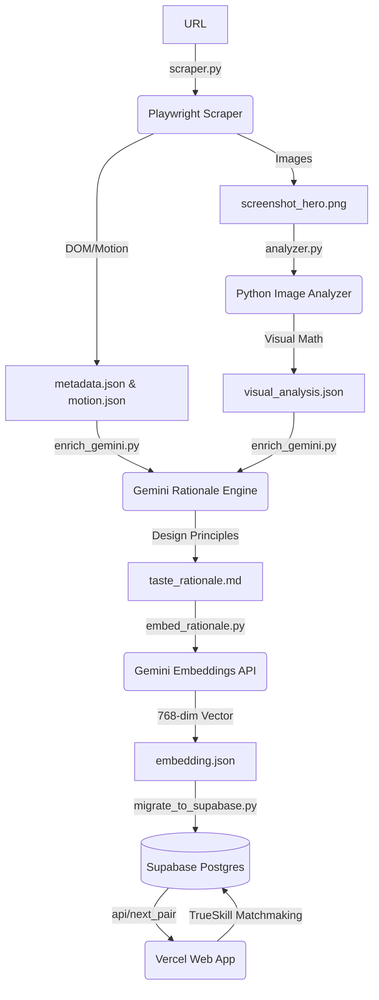

# TASTE Engine: Comprehensive Project Journal & Architecture

## 1. Executive Summary & Core Motivation
The goal of **TASTE** (Training AI for Structured Taste Engine) is to create the first AI system capable of understanding and quantifying subjective design "taste"—specifically structural layout, typography, color harmony, and motion choreography—by reverse-engineering premium, award-winning websites.

We are bridging **Phase 0 (Validation)** and **Phase 1 (The Dataset & Taste Layer)**. This document serves as a comprehensive record of the engineering journey, the roadblocks encountered, the pivots made, the mathematics underlying the system, and the definitive next steps.

---

## 2. The Engineering Journey: Pivots & Roadblocks

Building an automated pipeline that can consistently extract structural math and aesthetic truth from highly complex, custom WebGL Awwwards sites is inherently difficult. We encountered several major roadblocks that required significant architectural pivots.

### 2.1 The Scraping Engine & Physics Revisions
Initially, we relied on standard Playwright automation to scroll pages and take screenshots. 
*   **The "Footer" Bug:** We discovered that on high-end sites, standard `window.scrollTo` or automated scrolling breaks because these sites use custom scroll-hijacking libraries (like Locomotive Scroll or Lenis). This caused the scraper to inadvertently capture the footer of the website and label it as the "Hero" section, corrupting our visual analysis dataset.
*   **The Pivot:** We implemented a strict execution order. The `screenshot_hero.png` is taken immediately upon DOM load, *before* any scrolling is initiated. We then replaced synthetic scrolling with native `mouse.wheel()` inputs to respect custom scroll physics for the 30-second video recording.

### 2.2 Anti-Bot Defenses & WebGL Intro Gates
Not all sites render immediately.
*   **The "Enter Site" Trap:** Sites like `site-059` trapped the scraper in full-screen WebGL loading states, requiring the user to click "Enter" or "Découvrir" to view the site. This caused our visual math to analyze a black loading screen.
*   **The Pivot:** We implemented "Strategy 1.5" in the overlay dismissal routine. The scraper now aggressively scans the DOM for typical Awwwards entry triggers (e.g., "Enter", "Explore", "Start Experience", "Découvrir"), clicks them, and waits for the WebGL transition to finish before capturing the DOM.
*   **Anti-Bot Walls:** We observed that `site-086` completely blocked Playwright, returning only a 64-node DOM and a 17kb image (likely a Cloudflare check). **Lesson for Phase 3:** Scaling to 1,000 URLs will require `playwright-stealth` or a residential proxy network.

### 2.3 The Voting Architecture Pivot
Our original plan for Reinforcement Learning from Human Feedback (RLHF) was a local terminal script (`elo_validator.py`) where a single user would press '1' or '2' to vote on images locally.
*   **The Bottleneck:** We realized that training the algorithm required roughly 750 votes (10-15 comparisons across 100 sites). Doing this locally by one person was tedious and prone to bias.
*   **The Pivot (Vercel & Supabase):** We abandoned the local terminal approach and built a real-time Next.js web application. However, Vercel's serverless architecture meant we couldn't use local JSON files to store scores. We pivoted the entire architecture to a **Supabase (PostgreSQL)** backend, allowing multiple team members to vote simultaneously on their phones.

---

## 3. The Mathematics of Matchmaking

To train our final model, we needed "Ground Truth"—a definitive ranking of what designs are actually good. We use **TrueSkill** (an advanced Bayesian rating system created by Microsoft) combined with **Cosine Similarity**.

### 3.1 Why TrueSkill over standard Elo?
Standard Elo assumes a player's skill is a single absolute number. TrueSkill models skill as a Gaussian distribution with two variables:
1.  **$\mu$ (Mu):** The estimated skill of the design (base 25.0).
2.  **$\sigma$ (Sigma):** The system's *uncertainty* about that skill (base 8.333).

When a highly uncertain site beats a highly confident site, the point swing is massive. This allows the leaderboard to stabilize with significantly fewer votes (500 instead of 5,000).

### 3.2 The Matchmaking Algorithm (Vibe Matching)
We do not pit random sites against each other. To get accurate aesthetic judgments, users must compare apples to apples (e.g., a dark-mode brutalist site vs. another dark-mode brutalist site).

**Step 1: Pick the most uncertain site.**
```python
# Sort by highest sigma (most uncertain)
data.sort(key=lambda x: x["sigma"], reverse=True)
top_uncertain = data[:5]
site_a = random.choice(top_uncertain)
```

**Step 2: Find its closest aesthetic twin using Cosine Similarity.**
We use Gemini's `text-embedding-004` model to convert the site's structural rationale into a 768-dimensional vector. We then find the closest twin mathematically:
$$\text{similarity} = \frac{A \cdot B}{||A|| \times ||B||}$$

```python
def cosine_similarity(v1, v2):
    v1, v2 = np.array(v1), np.array(v2)
    return np.dot(v1, v2) / (np.linalg.norm(v1) * np.linalg.norm(v2) + 1e-9)

# Calculate similarity for all candidates against Site A
for candidate in candidate_pool:
    candidate["_sim"] = cosine_similarity(site_a["vector"], candidate["vector"])

# Pick randomly from the top 5 most similar
candidate_pool.sort(key=lambda x: x.get("_sim", -1), reverse=True)
site_b = random.choice(candidate_pool[:5])
```

### 3.3 The "Draw/Skip" Edge Case
**The Problem:** The Vercel app was repeatedly serving the exact same pair (A vs B, then B vs A). This happened because skipping merely reloaded the page. Since the database didn't change, the algorithm simply grabbed the exact same two sites because they *still* had the highest uncertainty and highest similarity.
**The Fix:** We implemented the "Skip" button as a TrueSkill `is_draw=True`. A draw tells the algorithm: "These two are perfectly evenly matched." This mathematically lowers both of their $\sigma$ (uncertainties) without affecting their $\mu$ (skill). This brilliantly removes them from the immediate queue while strengthening the model's confidence.

---

## 4. Technical Architecture & Pipeline



### 4.1 Extracting Animation Code
How do we teach an AI to write GSAP animations? We steal the code from live sites. We inject the following script *before* the site loads to intercept the actual developer logic:
```javascript
// Intercept gsap.to / gsap.from / gsap.fromTo
['to', 'from', 'fromTo', 'set'].forEach(method => {
    const orig = gsap[method].bind(gsap);
    gsap[method] = function(...args) {
        window.__taste_gsap_calls.push({ method, args: JSON.stringify(args) });
        return orig(...args);
    };
});
```

---

## 5. Current Status & Achievements

**Goal:** Establish Phase 1 ground truth on 100 MVP sites.
**Current State:** 
*   **Data Completeness:** 99 sites successfully scraped, mathematically analyzed, embedded, and synced to Supabase.
*   **Voting Milestone:** **>620 Live Votes Captured.** The dataset averages ~12.18 comparisons per site, which officially breaches the TrueSkill stabilization threshold.
*   **Result:** We have established our "Ground Truth." The algorithm has successfully stabilized, definitively sorting sites into high-taste ($>30 \mu$) and low-taste ($<20 \mu$) buckets.

---

## 6. The Roadmap: Next Steps & Future Capabilities

We have finished gathering the data. Now we must build the AI that uses it.

### Phase 2 (Immediate Next Steps)
1.  **The Taste Extractor Script (`extract_taste.py`)**
    *   **The Goal:** Right now, we know *which* sites are good, but we don't know *why*. This script will query Supabase for the top 15 highest-rated sites. It will aggregate their raw math (Whitespace Ratios, Color Variance, Typography) and use Gemini to synthesize the **"Mathematical Rules of Good Taste"**.
2.  **The Web-Based Reference Analyzer (MVP Copilot UI)**
    *   **The Goal:** Add an "Analyze" tab to the Vercel web app. A user uploads a screenshot of their own WIP design. The backend extracts the visual math, embeds it, calculates its Cosine Similarity against the Ground Truth database, and outputs a highly specific critique (e.g., *"Your layout matches the top-tier brutalist category, but to achieve Top 10 Taste, you must increase your typography scale by 15% and tighten your whitespace."*)

### Phase 3 & Derivatives (Low Hanging Fruit)
*   **Scale to 1,000 URLs:** Refactor `scraper.py` into `batch_scraper.py` to autonomously scrape 900 more sites using stealth proxies.
*   **Figma Plugin Integration:** Wrap the Reference Analyzer endpoint into a lightweight Figma plugin API.
*   **Motion Spec Generator:** Since we captured the GSAP code of the top sites, we can build a prompt generator that translates a visual reference directly into production-ready GSAP timelines.
